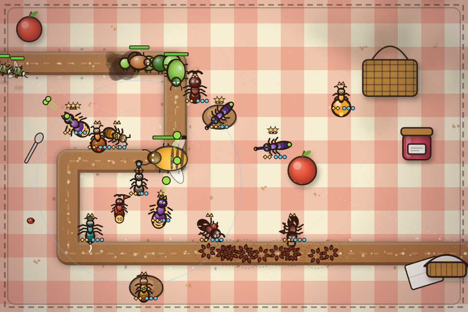

# workflo17

I build small, self-contained software: games, and local tools that run on the machine
instead of in someone's cloud.

Several of these run in your browser right now. The rest live in private repos, because
they're personal projects rather than products. This page is the index to all of it.

Lately that includes tools and workflows for businesses and local communities, not just
games. Bitemap and NYC Pulse are that thread pointed at the city's own open data, and
Night Desk is it pointed at a small business that cannot answer the phone at 2am.

**Everything in one place, with screenshots and one-click demos:
[donflo.vercel.app](https://donflo.vercel.app)**: client sites, design concepts, live
data maps, browser games and a colony of 3D ants, most of it openable from that page.

---

## Play something

### [Grubs TD](https://github.com/workflo17/ant-td) · [play it in your browser](https://workflo17.github.io/ant-td/)

A procedural ant tower defense in Canvas 2D and WebAudio. No build step, no dependencies,
no install: one page that works on desktop or phone, with a guided tutorial on the first
round.

### [Granulab](https://github.com/workflo17/granulab) · [play it in your browser](https://granulab-workflo17.vercel.app)

A falling-sand powder game in TypeScript and WebGL, with a sim core written twice (once in
TypeScript, once in AssemblyScript compiled to WASM) and a parity test proving the two
produce bit-identical worlds. A temperature field drives every phase change, from ice
melting to sand turning to glass at magma contact, and an in-game maker lets you invent
your own elements, chemistry included. A whole scene compresses to a share code of about
280 characters you can paste in chat.

### [FALA!](https://github.com/workflo17/fala) · [try it on your phone](https://workflo17.github.io/fala/)

A Brazilian Portuguese trainer that installs to a phone home screen: 240 cards, spaced
repetition, native neural audio, and no backend at all. It keeps working on the subway.

---

## The city, as data

### [Bitemap](https://github.com/workflo17/bitemap) · [open the map](https://bitemap-workflo17.vercel.app)

Every licensed restaurant in New York City, all 30,075 of them, on one 3D map colored by
cuisine, with curated food crawls drawn as subway strip maps. Vanilla JS and MapLibre GL
over the city's open inspection data. No build step, no paid APIs.

### [NYC Pulse](https://github.com/workflo17/nyc-pulse) · [open the dashboard](https://workflo17.github.io/nyc-pulse/)

Seven days of the city's 311 complaints, live from NYC Open Data. Socrata does the
counting server-side, the browser does the aggregation, and every chart is drawn by hand
on a canvas with no chart library. Each sentence under a chart is computed from whatever
data loaded, so nothing on the page is a number I typed in.

---

## Deep time, as data

### [Deep Ancestry Atlas](https://github.com/workflo17/deep-ancestry-atlas) · open the globe

An open-source research instrument for human migration: 262,000 georeferenced records from eight
published datasets on one 3D globe, in one HTML file with hand-rolled WebGL and no dependencies.
Ancient genomes, 175,000 radiocarbon dates, the Pleiades gazetteer, Roman roads, languages,
societies and ancient pathogens, all queryable together — pick a lineage and a radius and every
layer answers at once, exporting CSV with a resolvable citation on every row.

The lineage tree is computed, not typed in: haplogroup nomenclature *is* the topology, so
prefix-parsing the AADR's own calls across 19,029 dated individuals yields 701 clades. It is
built to argue with itself. A clade's date is its oldest observed member rather than a TMRCA, its
position is offered under two estimators that disagree, and when a traced route implies 11,508 km
per millennium the interface says that is not a rate of travel and explains why. The coverage tab
exists to make one number unavoidable: 99.3% of ancient genomes are younger than 15,000 BP, so
the deep-time story rests on under 1% of the evidence.

---

## Use something

### [Tend](https://github.com/workflo17/tend) · [see it work](https://tend-demo-workflo17.vercel.app)

An interactive work sample built for a job application in one day: a simulated SMS
re-engagement agent for a mental health company, with the sales reasoning behind every
message annotated beside the thread, red-team buttons that prove the crisis and opt-out
guardrails hold, and four follow-on products built as playable sketches. One HTML file,
no framework, no external requests.

### [The Mindbloom Dossier](https://github.com/workflo17/mindbloom-dossier) · [read it](https://workflo17.github.io/mindbloom-dossier/)

What came after Tend: seven pieces of lifecycle work for the same application, built in a
day. The one I'd point at is the safety piece, which ships a 90-message labeled test set
and a runnable harness proving the point. A naive keyword filter catches 4 of 30 crisis
messages while firing on 12 that were fine; adding idiom allowlists and context guards
clears every false alarm and still catches only those same 4. The conclusion is that you
cannot keyword your way to safe automated messaging, so the agent has to stop selling on
uncertainty instead of trying to be certain.

### [Night Desk](https://github.com/workflo17/night-desk) · [talk to it](https://workflo17.github.io/night-desk/)

A voice receptionist for an invented late-night diner. You hold the bell and talk; it
answers out loud. Speech in and out are the browser's own APIs, and the brain is a
hand-written state machine, not an LLM call: it books a table by asking for party size,
day, time and name, re-asks whatever you skipped, recaps, and only commits when you say
yes. A panel beside the chat logs the intent and state for every turn, so you can watch it
reason instead of taking my word for it.

### [JobFit Lens](https://github.com/workflo17/jobfit-lens)

A Chrome extension that scores the job posting you're reading against your own skill
list: match percentage, missing skills, salary and remote signals. Runs entirely on your
machine, reads the page only when you click the icon, and the scoring engine ships with
its node test suite.

### [agent-lanes](https://github.com/workflo17/agent-lanes)

The coordination protocol I use to run multiple AI coding agents on one codebase at the
same time: single-writer lanes, a shared board, landing rules. Three markdown files,
nothing to install. Distilled from the system that keeps parallel sessions from colliding
on the ant simulations below.

---

## Ants, at length

Two simulations, one question: what does a colony do when nobody is playing it?

**Vivarium** · *private* · Three.js / WebGL

A zero-player ecosystem simulation. It's a 3D volume of soil you orbit, slice and X-ray
while colonies dig branching underground cities, forage, war, breed and die on their own
for weeks. There's no win condition. The camera sweeps in one motion from a god's-eye view
of the whole terrarium down to street level behind a single high-detail ant with
articulated legs and working mandibles, which stays cheap because visual detail is
decoupled from the simulation. The sim is deterministic and snapshot-safe: same seed, same
event stream, every run.

**A Living Formicarium** · *private* · vanilla JS

The 2D sibling. It ships as one self-contained `.html` file, so it can go to Steam or
Google Play without a runtime. A test suite proves the editable module split never drifts
from the shipped monolith.

**Ant Raid** · *private* · Node.js + WebSockets

Grubs TD's offensive sibling: a multiplayer game where friends join with a room code and
play the swarm instead of the defense.

---

## Also built

**Castle Clash Live** · *private* · Node.js

A game that *is* a TikTok LIVE stream. Viewers play by commenting, liking and sending
gifts; a backend reads the live chat feed and pipes those events into a 1080×1920 canvas
that LIVE Studio captures. It's playable end to end against a built-in event simulator,
with no TikTok connection at all.

**ECHO** · *private* · Next.js + TypeScript + Postgres

A music discovery backend whose recommendations explain their own ranking instead of
returning an unexplained list. Runs in a seeded demo mode with no database attached, and
switches to Postgres when you give it one.

**LED Studio** · *private* · Node.js

A control surface for desktop RGB lighting. It speaks the OpenRGB SDK protocol over TCP
directly, with zero npm dependencies, and serves demo devices while the daemon is down so
the interface still works.

---

## Tooling I use on my own work

### [first-party-analytics](https://github.com/workflo17/first-party-analytics)

Conversion tracking for a static site with no third-party script, no cookies and no
consent banner. A serverless collector, a private blob store, and a dashboard behind a
key. Each event's summary is encoded into its storage key, so the dashboard builds every
table from one list call instead of fetching a few hundred bodies. Running in production
on the portfolio above.

### [agent-lanes](https://github.com/workflo17/agent-lanes)

Coordination for several coding agents working the same repo at once, so they do not land
on each other's files.

---

## How I build

**No build step where I can avoid one.** Grubs TD, Bitemap, FALA! and A Living Formicarium
are all just files you can open.

**Local-first.** Most of these run on a machine rather than a server, and keep their data
there. Night Desk does its speech and its thinking in the browser; NYC Pulse asks the
city's API to do the counting and aggregates the rest client-side. The public projects up
top are the slice that could travel.

**Determinism is a test, not a promise.** A change to Vivarium's sim has to produce a
bit-identical event stream from the same seed, and its snapshots have to round-trip
byte-identical, before it lands. Granulab holds its two engines to the same standard.

**Built by directing agents.** I have no formal programming background; everything here
is built by directing fleets of AI coding agents, coordinated with
[agent-lanes](https://github.com/workflo17/agent-lanes) when several work the same repo
at once. The craft I bring is knowing what to build, what good looks like, and what to
refuse.

**Working with:** JavaScript · TypeScript · Node · Three.js / WebGL · Canvas 2D ·
MapLibre GL · Next.js · Postgres · Python · Blender

---

Found a bug, or got stuck somewhere? Open an issue on whichever public repo is closest.
"This part confused me" counts as a bug report here, and it's the most useful kind.
